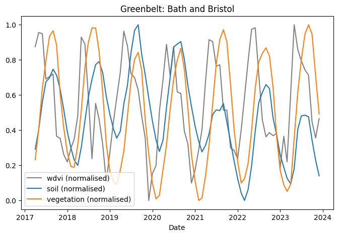
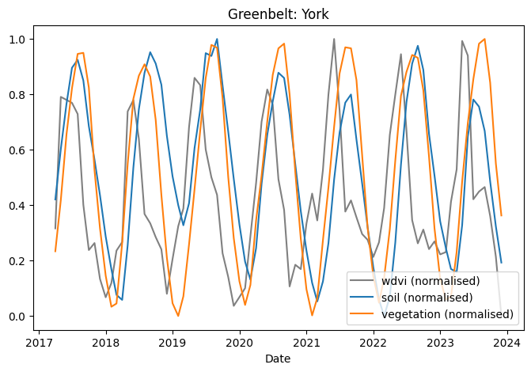

# Correlation Report

## Introduction
Reporting Predictive Power Scores ([PPS](https://macrosynergy.com/research/the-predictive-power-score/)) and Pearson Correlation Coefficient ([PCC](https://www.sciencedirect.com/topics/computer-science/pearson-correlation)) analysis for the Soil and Vegetation models from JULES. 

### Correlation coefficient
The correlation coefficients reported are standard PCCs, calculated as:

$$
r = \frac{\sum (x_t - \bar{x})(y_t - \bar{y})}{\sqrt{\sum (x_t - \bar{x})^2} \sqrt{\sum (y_t - \bar{y})^2}}
$$

where $x_t$ and $y_t$ are individual datapoints, at time $t$, from the two data series being compared:

- $\{x_1, x_2, ... x_T\}\ \in \mathbf{x}$ 
- $\{y_1, y_2, ... y_T\}\ \in \mathbf{y}$ 

### Predictive power scores  
A metric for predictive relationships between data series. Capable of handling non-linear relations, categorical data, and asymmetric relations. This score is independent of any offset in the two series, such as one lagging behind another. 

PPS is computed by training a simple decision tree to model one series from the other, measuring the model error and comparing it to a naïve baseline (e.g., mean prediction for regression, majority class for classification):

$$
PPS = 1 - \frac{\text{model error}}{\text{baseline error}}
$$

where 

- A score of 0 indicates no predictive relationship.
- A score of 1 indicates that each data series can perfectly predict the other. 

### Scaling and Normalisation
Each value is the mean average over a particular greenbelt, for a single month, averaged over the area. The averages for the area of a greenbelt are computed as a weighted average of the comprising polygon area averages reported by Google Earth Engine (GEE).

## Results

### Pearson Correlation
Heatmap of the mean correlation, averaged over the greenbelts, of the computed indices with the vegetation and soil models from JULES.

 This was taken from the full correlation matrix in the Appendix. 

The distribution of correlations for each index can be seen in the box plot below:

_by_greenbelt_(sorted_high_->_low).png)

\newpage

### Predictive Power Scores
The predictive power scores are largely zero, except for the odd outlier. In some greenbelts however they appear above zero- suggesting a relationship does exist. 

Heatmap of the mean PPS, averaged over the greenbelts, of the computed indices with the vegetation and soil models from JULES.

 This was taken from the full correlation matrix in the Appendix. 

The distribution of pps scores for each index can be seen in the box plot below:

_by_greenbelt_(sorted_high_->_low).png)

### WDVI
The WDVI index is the most highly correlated, on average, with soil and vegetation carbon. Below we see some comparisons of the time-series for WDVI with soil and vegetation JULES models for a subset of greenbelts. The subset were chosen at random and the full set is available in the appendix.

\newpage

### Improvements

The data seems to show a better correlation than the  computed coefficients bely in places. There is an abvious issue with the missing data. For example here:

I have linearly interpolated them missing WDVI data, which is negatively impacting the calculated correlation. I will revise the calculations to ignore the missing values rather than interpolation (I was not invisseging interpolating such a large gap, so thought linear interpolation would suffice.)

---

\newpage

# Appendix

## Correlation matrix

## PPS matrix

## WDVI all greenbelts

